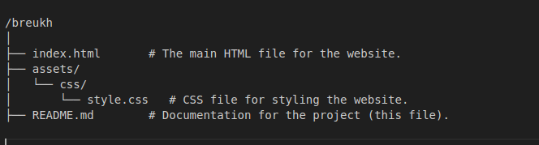

Breukh Website - Float-Based Layout.
This project is a static website designed to replicate the visual design of "Breukh," an online store, using only the CSS float property for layout. The project will also incorporate responsive design to ensure usability on different devices.

Project Objectives
Accurate Design Replication: Recreate the given website design.
CSS Layout Constraints:
Use only the float property for layout.
Avoid IDs, classes, and pseudo-elements for styling.
Responsive Design: Implement a flexible layout that adapts to various screen sizes.
Features
Navigation Bar: Links to categories like Laptops, Accessories, and Cameras.
Featured Collections: Highlighted product collections for key categories.
Product Grid: Displays new products with pricing, discounts, and ratings.
Responsive Design: Optimized for desktops, tablets, and smartphones.
Project Structure
Here’s the directory structure for the project:

/breukh
│
├── index.html       # The main HTML file for the website.
├── assets/
│   └── css/
│       └── style.css   # CSS file for styling the website.
├── README.md        # Documentation for the project (this file).

Installation.
Clone the repository or download the files.
Navigate to the project directory and open index.html in your browser.
Development Notes.
The layout is achieved using the CSS float property for all components and sections.
Responsive Design: Media queries will be used to adjust the layout for various devices.
No JavaScript frameworks, libraries, or additional CSS tools are used—this is a pure HTML/CSS project.
Semantic HTML elements are used for better accessibility.